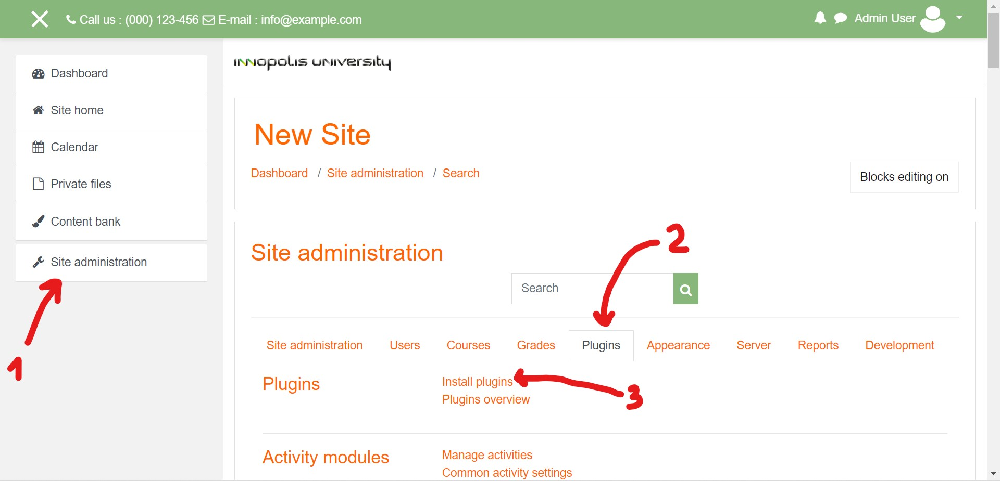
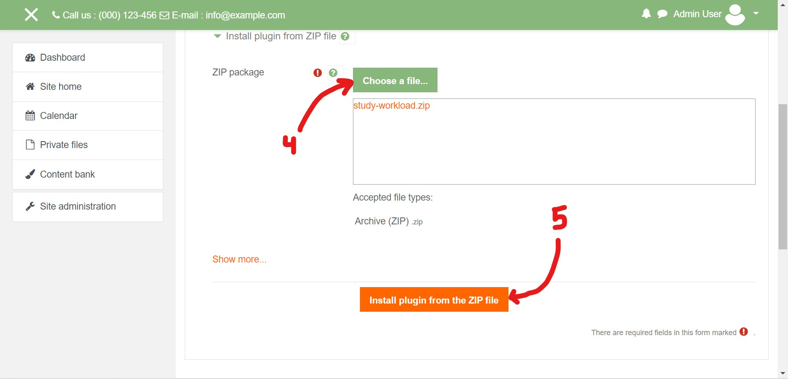
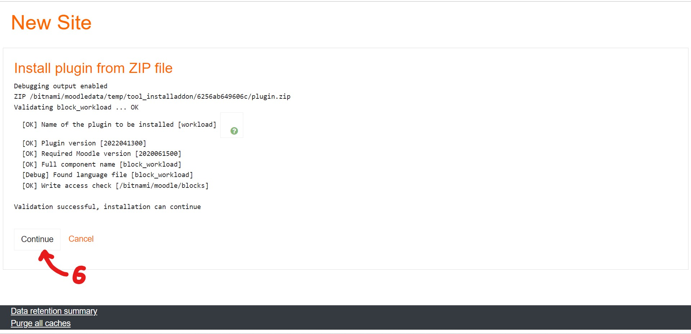
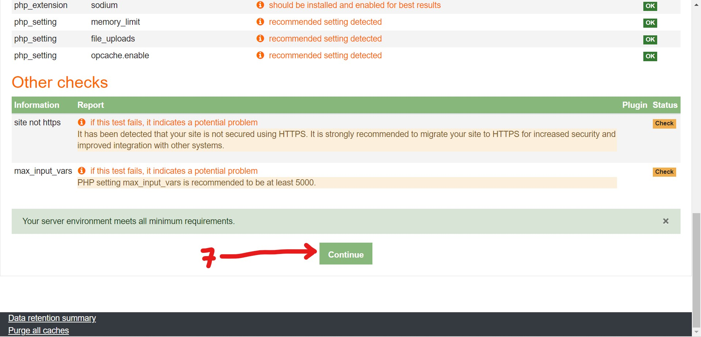
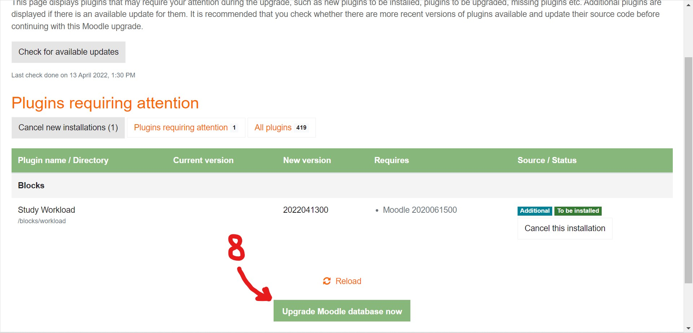
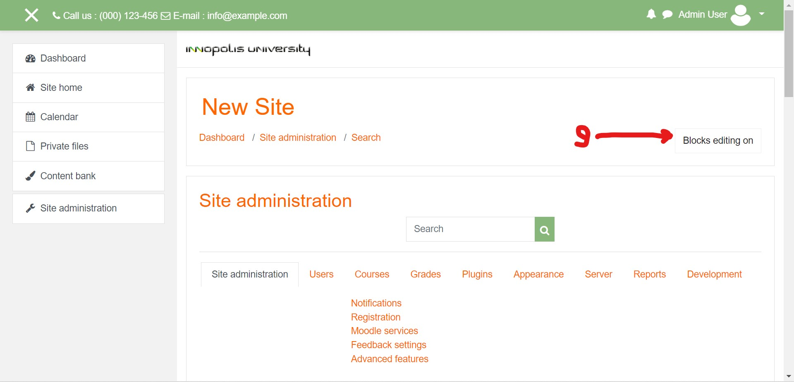
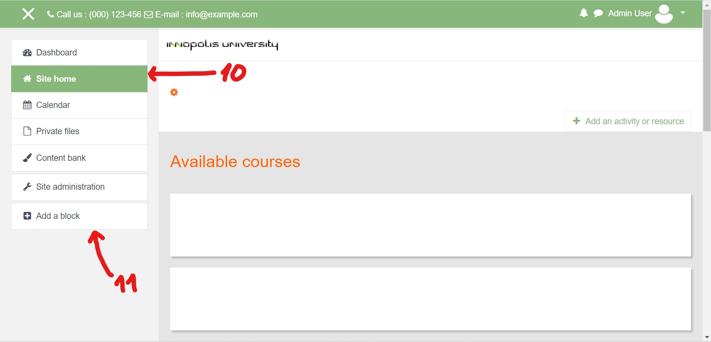
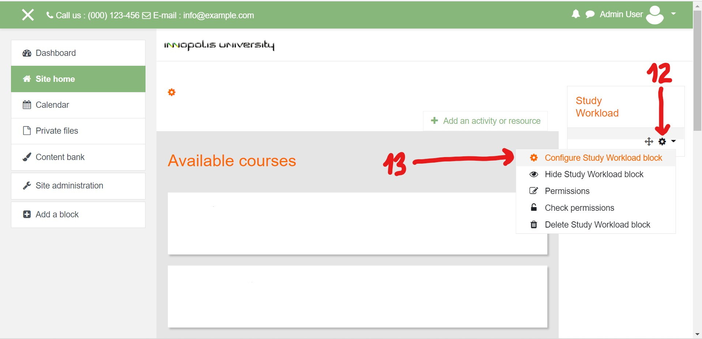
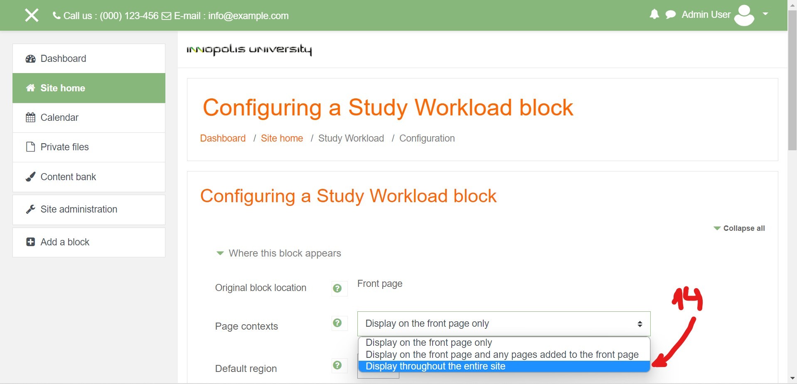

# Study Workload plugin for Moodle

This plugin adds blocks for students and teachers to see course workload and schedule assignments more efficiently.

## Installation

Download the `study-workload.zip` from [the latest release](https://github.com/illright/workload-moodle-iu/releases/latest).

Log in to your Moodle instance as an administrator, then go to **Site Administration**, the **Plugins** tab. 

Checkpoint

Click **Install plugins**, upload the ZIP file and click the **Install plugin from ZIP file** button below. You will be prompted to upgrade your database, agree to it.

Checkpoint

After the plugin is installed, go to **Site Administration** again as an administrator and click the **Blocks editing on** button above the settings to the right. 

Checkpoint

Then go to **Site Home** (the second entry in the left side panel) and click the **Add a block** button in that same side panel, all the way down below. Choose **Study Workload** from the list of entries and add the block. You will see it pop up to the right.

Checkpoint

Click the gear icon on the newly created block and select **Configure Study Workload block**.

Checkpoint

In the **Page contexts** field, select **Display throughout the entire site**.

Checkpoint

Congratulations, you're done! :)

